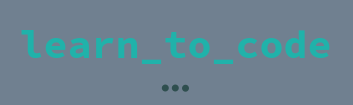
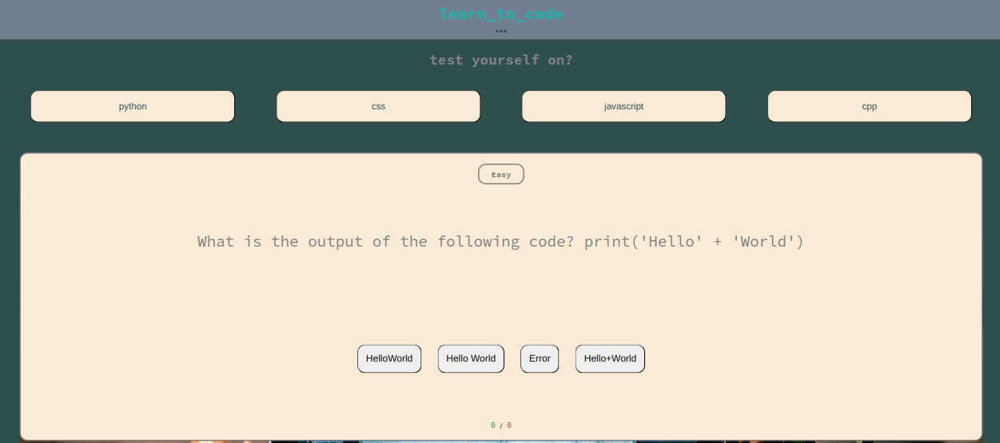
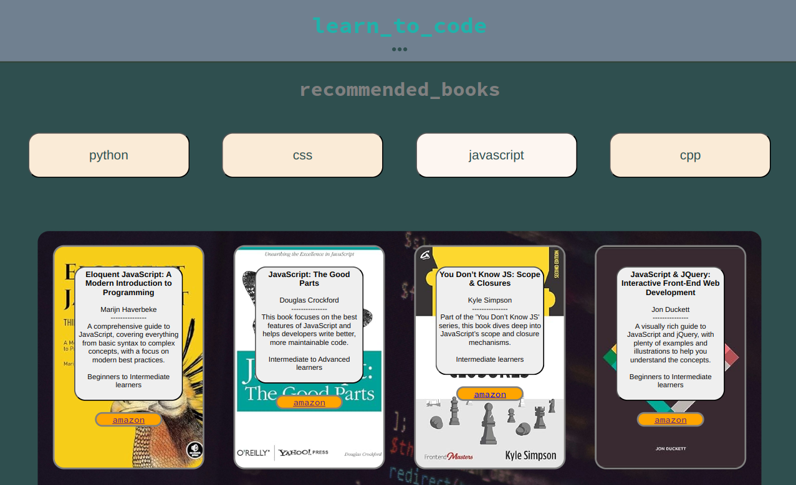

# Learn To Code

## Intro

Learn to code is a site intended for aspiring and also more experienced developers. The site in it's current MVP state only has two pages of resources for developers, a coding challenge page and a recommended books page. Both these pages allow a developer to select a particular coding language from a current list of Python, CSS, JavaScript and CPP (C plus plus).

## Features

### Existing Features

- **Navigation Ellipsis**

  - The navigation ellipsis is available on both current pages of the site, so that navigating between the different pages is made easy no matter what page the user is currently on. Using the same navigation bar on each page ensures that 'how' a user navigates is consistent across all pages.

    

- **Coding Challenge Page**

  - The coding challenge/quiz page is where site users can challenge themselves by selecting a coding language and then answering the 20 questions which will be asked at random from the pool of 29 available questions for each. Questions come in 3 categories 'Easy', 'Medium' and 'Hard' and the category of question is displayed for the user to see.

    

- **Recommended Books Page**

  - This page loads without content and waits for a user to select a programming language. When a selection is made 10 books display on the screen in various formations on the screen using flexbox. Each book has a blurb appearing over a background image of the book's cover with information on the book such as author, title, description, target reader and each book also has an active link that will navigate the user to that particular book on Amazon.

    

- **Footer**

  - The footer allows users to navigate to various "learn to code" social media sites, such as a Facebook page, an Instagram page, Twitter/X and also a Snapchat page.

    

#### Button/Links

All buttons and links from within the Footer navigate the user to a newly opened tab featuring the relevent content. All Amazon links on the recommended books page navigate the user to the corresponding book on Amazon, again on a new tab.

### Features Left to Implement

There are a few things on the site that I would like to implement next:

- The blurb overlaying the book images on the book recommendations page would ideally only display while a user hovers over the image of the book's cover so that the focus is solely on the book the user is interested in.
- Other programming languages could be added to the site quite easily, and that would be something that I would like to do next.
- Social media sites are currently not active as the site does not yet have social media.
- Scores are tracked while a user is playing a game currently but this information is lost once a player restarts another game. Ideally this information would be captured and displayed in a leaderboard. By making it more competetive this should increase engagement in the site.
- Ideally there would be more questions available at all difficulty levels so that a user could opt to play a game at each of the available levels only.

## Manual Testing

- The site was tested extensively using Chrome devtools to confirm that all pages look and behave as expected across all device sizes.
- All links in the footer and also the Amazon links were tested to confirm that each will open a new browser tab and bring the user to the intended destination site.

### Validator Testing

- **HTML**
  - No errors were found using the official W3C validator
- **CSS**
  - No errors were found using the the official (Jigsaw) validator

## Deployment

- The site was deployed to GitHub pages. The steps to deploy are as follows:
  - In the GitHub repository, navigate to the Settings tab
  - From the source section drop-down menu, select the Master Branch
  - Once the master branch has been selected, the page will be automatically refreshed with a detailed ribbon display to indicate the successful deployment.

The live link can be found here - https://cmcdgit.github.io/learn-to-code/index.html

## Credits

### Content

- The icons in the footer were taken from [Font Awesome](https://fontawesome.com/)
- The questions for the Quiz page were generated using [ChatGPT](https://chatgpt.com/) and then successfully passed a test for plagiarism
- The array of books used to populate the book recommendations page were generated using [ChatGPT](https://chatgpt.com/) and also successfully passed a test for plagiarism
- The favicon icon in the tab/title bar was created by Soetarman Atmodjo and was taken from [The Noun Project](https://thenounproject.com/browse/icons/term/coding/)

### Media

- All book images are from (https://www.amazon.co.uk/)
- The background photo on the coding challenge page is available thanks to Karthik Swarnkar on [Unsplash](https://unsplash.com/photos/a-close-up-of-a-computer-screen-with-a-bunch-of-text-on-it-AoNvwL-Dmtw)
- The background photo on the recommended books page is available thanks to Radek Grzybowski on [Unsplash](https://unsplash.com/photos/macbook-pro-on-brown-wooden-table-inside-room-eBRTYyjwpRY)
